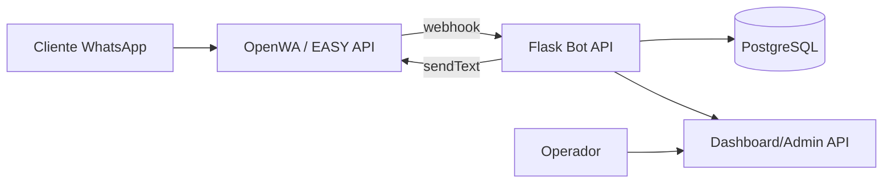

# Arquitetura

## Por que separar Flask e OpenWA?

OpenWA controla a sessão WhatsApp Web e pode exigir QR Code, Chrome/Browser e persistência de sessão. O Flask fica stateless, escalável e focado no produto: regras, dados, tickets, catálogo, reservas e analytics.

## Tabelas principais

- `tenants`: estabelecimentos.
- `channels`: configurações do WhatsApp/OpenWA por estabelecimento.
- `contacts`: clientes.
- `conversations`: conversas e estado do bot.
- `messages`: histórico completo.
- `faq_entries`: base de perguntas e respostas.
- `products`: serviços/produtos/preços.
- `bookings`: reservas/agendamentos.
- `support_tickets`: chamados e handoff humano.
- `campaigns`: disparos simples.
- `outbox_messages`: rastreio de envios.
- `analytics_events`: eventos para métricas.

## Fluxo de mensagem

1. OpenWA recebe mensagem no WhatsApp.
2. OpenWA chama `/webhooks/openwa` no Flask.
3. Flask valida o segredo do webhook.
4. Flask normaliza o payload e salva contato, conversa e mensagem.
5. Motor do bot classifica intenção e consulta FAQ/produtos/estado.
6. Flask cria tickets/reservas quando necessário.
7. Flask responde chamando OpenWA `sendText`.
8. Outbox e mensagem outbound ficam salvos no Postgres.
